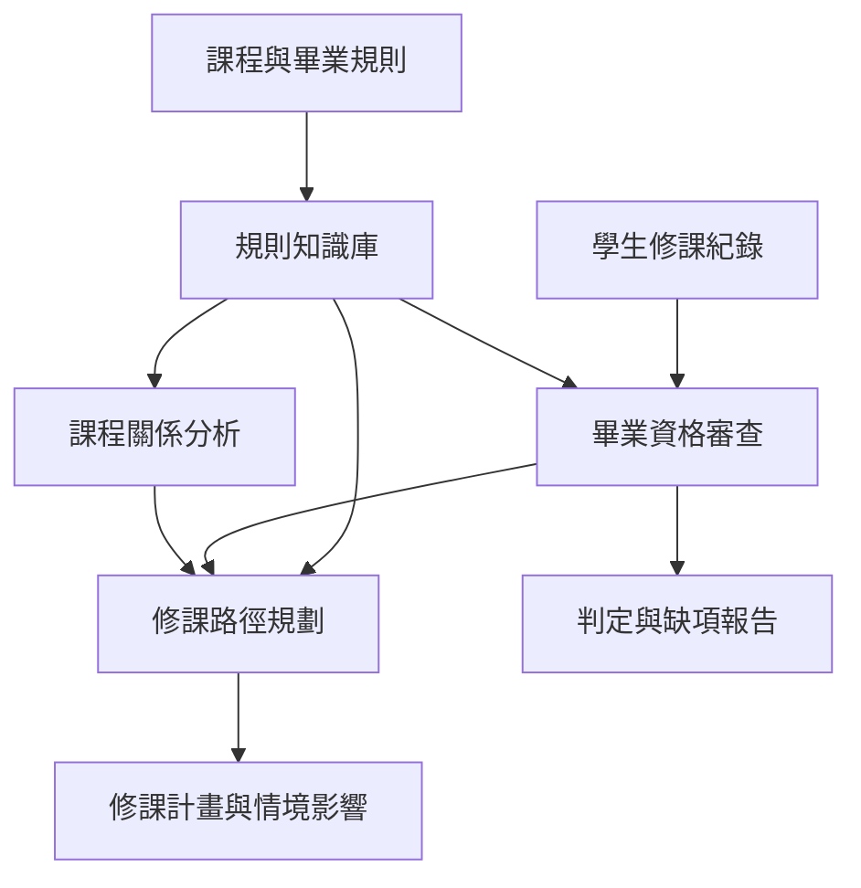
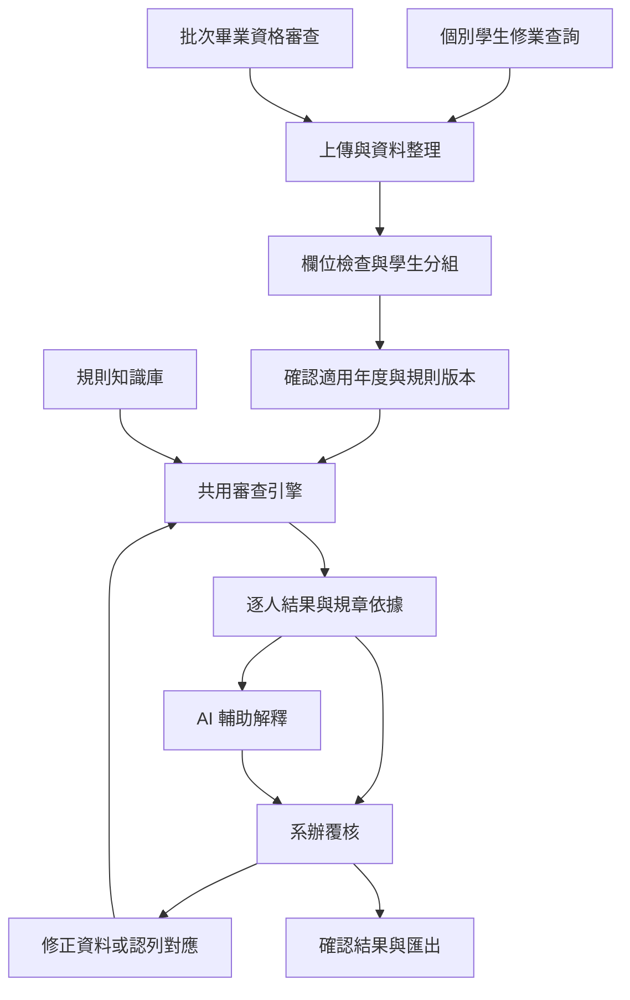

# Academic Twin 專案設計與主要流程

更新日期：2026-10-06。本文記錄目前定案架構；尚未建置的流程另行標示。

## 專案目的

將課程規章、課程關係與學生修課紀錄連結起來，提供可追溯的修業進度、畢業資格審查、修課路徑與情境模擬。

系辦端確定提供兩個並列業務入口：個別學生修業查詢、批次畢業資格審查。兩者共用同一套審查核心。詳細需求見 [系辦端業務需求](OFFICE_REQUIREMENTS.md)。

## 四個核心模組

| 模組 | 現有檔案 | 職責 |
|---|---|---|
| 規則知識庫 | `academic_twin/knowledge_base.py` | 載入及驗證課程、要求、學分認列政策、來源 |
| 畢業資格審查 | `academic_twin/rule_engine.py` | 分類修課紀錄、計算學分、檢查缺項、產生判定 |
| 課程關係分析 | `academic_twin/graph.py` | 正式與建議先修、前後課程影響及瓶頸分析 |
| 修課路徑規劃 | `academic_twin/planner.py` | 依審查結果、課程圖及情境安排後續修課 |

四個模組在核心能力上並列，但有資料依賴；不代表執行時必須平行運算。`app.py` 是目前串接模組的命令列入口。

基本查詢與畢審使用知識庫和審查引擎即可；需要安排未來修課時再接入課程圖與規劃器。

## 系辦端共同流程

上傳介面、AI 整理、規則選擇介面、覆核與匯出仍待建置。此圖描述目標流程。

## 個別學生修業查詢

1. 取得學生代號、入學年度、系所／學制、修課成績與抵免等資料。
2. 匯入紀錄；AI 文件解析結果須呈現供確認，避免錯讀課號、學分或成績。
3. 檢查資料完整性，確認適用規則；未確認的抵免、舊課號及特殊核准列為疑義。
4. 審查引擎逐條產生已達成數量、缺額、缺課與依據。
5. 顯示缺項、警示與人工確認事項；AI 將結構化結果轉成容易理解的說明。
6. 系辦確認疑義、更新資料後重新審查，提供結果。
7. 如需後續修課安排，再使用課程圖與規劃器。

指定必修列出課號與課名；類別需求列出類別缺額；選修候選課程必須區分「可選」與「全部必修」。

## 批次畢業資格審查

1. 上傳應屆畢業生名單與修課資料。
2. 按學生分組並核對名單；沒有紀錄的學生進入異常清單，不可漏掉。
3. 每位學生使用其適用年度及規則執行相同審查邏輯。
4. 產生總覽：學生代號、狀態、主要缺項、警示及待覆核事項。
5. 系辦查看單人明細與規章依據，處理課號對應、抵免及特殊核准。
6. 修正後重新審查，記錄確認內容及使用的規則版本。
7. 匯出總覽與逐人缺項明細。

## AI、規則引擎與系辦分工

| 角色 | 責任 |
|---|---|
| AI | 輔助解析與整理文件、解釋審查結果、提供問答 |
| 規則引擎 | 按明確規則計算採計學分、判定要求是否滿足、輸出依據 |
| 系辦 | 確認正式規章、疑義、抵免及特殊核准，完成最終業務確認 |

AI 說明以審查結果為依據，不自行更改學分或創造規章。未確認的資料與規則假設需可見。

## 結果與可追溯性

| 現有狀態 | 語意 |
|---|---|
| `PASS` | 已建檔要求全滿足，無引擎識別出的待核對項目 |
| `FAIL` | 至少一項已建檔要求未滿足 |
| `WARNING` | 要求滿足，但含暫時採計的未核對本系課程 |
| `MANUAL_REVIEW` | 類別資料無法認列，需要人工確認 |

目前狀態優先序為人工審查、未達標、警示、通過；報告仍需展示所有缺項與待核對資料。

介面需分開顯示系統判定與系辦確認狀態。系統通過表示輸入符合已建檔規則，不表示已完成所有正式核定程序。

現有要求帶有來源引用；目標報告還需記錄適用年度、規則版本、資料來源及審查時間，覆核需保留確認人與處理內容。完整紀錄功能尚待建置。

## 已定案與待決事項

已定案：四個核心能力、兩個系辦業務入口、共用審查引擎、AI 輔助且規則負責判定、系辦處理疑義。

待決：實際上傳格式、校務欄位、介面技術、AI 服務、資料儲存與權限、覆核紀錄、匯出格式，以及各年度正式規則與特殊認列細節。

現況及規則假設見 [實作狀態](IMPLEMENTATION_STATUS.md)。

